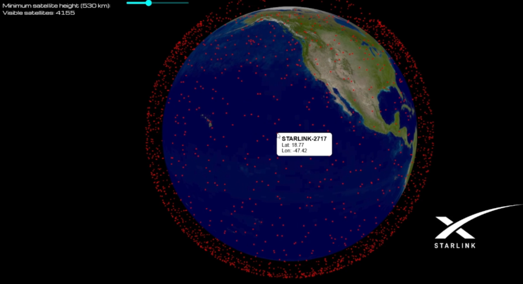

# StarlinkTracker
**An interactive 3D visualization of Starlink satellites orbiting Earth, based on real-time TLE data**

  

## Features

- Real-time rendering of Starlink satellite positions
- Earth globe with zoom & rotate (mouse-controlled)
- Tooltip showing satellite name and coordinates
- Altitude slider to filter satellites by orbital height

  

## Technologies Used

- **React** – component structure and interactivity  
- **Three.js** – 3D globe rendering  
- **satellite.js** – orbital mechanics & TLE parsing  
- **Vite** – fast development server and bundler
